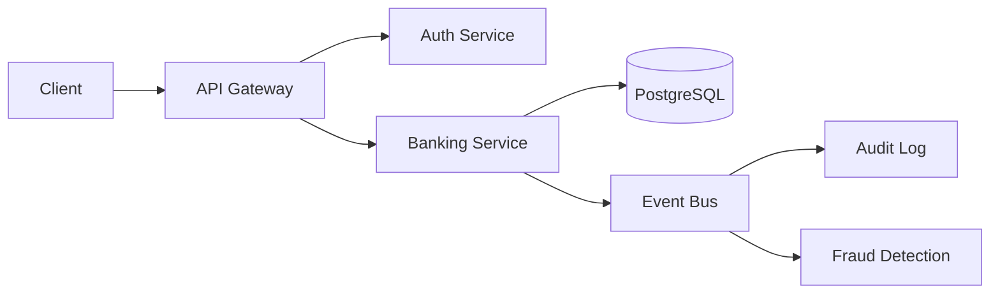

# Secure Auth Service


[](https://github.com/Raphasha27/secure-auth-service/actions)
[](https://github.com/koketseraphasha/secure-auth-service/actions/workflows/ci.yml)

Enterprise authentication and MFA service for banking systems. JWT-based with multi-factor support.

## Features
- JWT authentication
- Multi-Factor Authentication (MFA)
- Password hashing (BCrypt)
- Session management
- Role-Based Access Control (RBAC)


## Architecture



Microservices-based architecture with API Gateway, authentication layer, PostgreSQL persistence, and event-driven communication.

## Stack
Java 21, Spring Boot, Spring Security, PostgreSQL, Docker

## Quick Start
```bash
docker compose up -d
```

## Deployment & Architecture

This project is designed with cloud-ready principles:

- **Containerized** using Docker for consistent deployment
- **Environment-based configuration** — no hardcoded secrets
- **Modular structure** for independent scaling
- **Stateless design** where applicable
- **Separation of concerns** for maintainability

### Run Locally

`ash
docker-compose up --build
`

---

*Part of the Kirov Dynamics Technology portfolio — backend engineering focused on security, scalability, and system design.*
